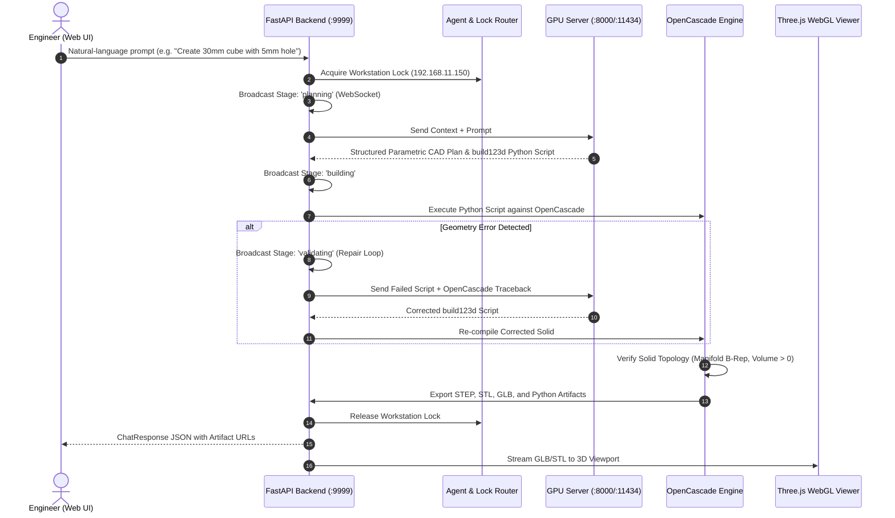

# ATS Engineering AI — Text-to-CAD & Autodesk Integration Platform
### Comprehensive Technical Documentation & Architecture Manual

**Project URL**: [https://github.com/dkoustubh/TextToCad-](https://github.com/dkoustubh/TextToCad-)  
**Docmost Space**: `general`  
**Docmost Page ID**: `auto-desk-integration-MJ98bUR5Kc`  
**Lead Contributor**: `dkoustubh` (Koustubh Deodhar)

---

## 1. Executive Summary

**ATS Engineering AI (TextToCad-)** is an enterprise industrial AI workbench that translates natural-language mechanical engineering commands into watertight, ISO-standard **3D Boundary Representation (B-Rep)** CAD solid models.

The system connects local large language model reasoning (Gemma 4 31B via vLLM / Ollama) on central GPU infrastructure with local OpenCascade geometric kernels and remote Autodesk Inventor engineering workstations on the LAN.

```
+--------------------------+       +----------------------------+       +----------------------------+
|   Engineer Browser UI    | <---> |   FastAPI & CAD Engine     | <---> |   AI / GPU Server          |
|   (Three.js 3D Viewer)   |       |   (OpenCascade / build123d)|       |   (192.168.11.86 / vLLM)   |
+--------------------------+       +----------------------------+       +----------------------------+
                                                 |
                                                 v
                                   +----------------------------+
                                   | Autodesk Workstation (PC)  |
                                   | (192.168.11.150 / Inventor)|
                                   +----------------------------+
```

---

## 2. Infrastructure & Network Topology

The platform operates across three dedicated network nodes on the internal engineering subnet (`192.168.11.0/24`):

| Machine Name | IP Address | OS / Hardware | Assigned Role |
| :--- | :--- | :--- | :--- |
| **AI / GPU Server** | `192.168.11.86` | Linux (96 GB VRAM GPU) | vLLM / Ollama inference host running `google/gemma-4-31B-it` and `qwen3-coder:30b` on ports `8000` & `11434`. |
| **Autodesk Workstation** | `192.168.11.150` | Windows 11 PC | Hosts licensed **Autodesk Inventor** under engineer profile (*Koustubh Deodhar*). Executes native `.ipt`/`.iam` operations. |
| **Workbench & Kernel Node** | `192.168.11.94` | macOS / Linux | Runs FastAPI backend (`port 9999`), OpenCascade B-Rep solid compiler, validation engine, and serves Three.js UI. |

> **Critical Licensing Rule**: The AI server must *never* run Autodesk desktop applications directly. All native Autodesk actions execute on `192.168.11.150` using the engineer's licensed Autodesk session.

---

## 3. End-to-End Execution Pipeline



---

## 4. Multi-Turn Iterative Modifications

The workbench supports multi-turn conversational design modifications where each change directly updates the active 3D model in real time.

### Supported Modification Patterns:

1. **Dimensional Resizing**:
   - *"Reduce the length to 20mm"*
   - *"Change width to 40mm"*
   - *"Make height 15mm"*
   - *"Scale to 150 x 80 x 25 mm"*

2. **Feature Additions**:
   - *"Add a hole of 2mm in the center"*
   - *"Add four 8mm corner mounting holes"*
   - *"Drill a 10mm bore through the top"*

3. **Feature Updates**:
   - *"Increase the hole diameter to 6mm"*
   - *"Change center bore to 25mm"*

4. **Edge Blends & Treatments**:
   - *"Add 3mm fillet to vertical corners"*
   - *"Chamfer the edges by 2mm"*

5. **Unit Normalization**:
   - Supports millimeters (`mm`), centimeters (`cm`), meters (`m`), and inches (`in`).

---

## 5. Artifact Formats & Export Capabilities

For every design and iteration version, four distinct engineering artifacts are automatically compiled and stored in `exports/`:

| Format | Extension | Target Application / Consumer |
| :--- | :--- | :--- |
| **STEP** | `.step`, `.stp` | ISO 10303 exchange standard for Autodesk Inventor, Fusion 360, SolidWorks, Siemens NX, and FreeCAD. |
| **STL** | `.stl` | Tessellated mesh for 3D printing slicers (PrusaSlicer, Bambu Studio, Cura) and CNC toolpath CAM. |
| **GLB** | `.glb` | Compact binary glTF for ultra-fast, direct in-browser 3D WebGL rendering in Three.js. |
| **Python Script** | `.py` | Reproducible, editable `build123d` parametric source code. |

---

## 6. API Reference

### 6.1 Versioned CAD Generation
* **Endpoint**: `POST /api/projects/{project_id}/versions`
* **Request Payload**:
```json
{
  "prompt": "Create a 30mm cube with a 5mm through hole",
  "project_id": "proj_1787126056",
  "session_id": "session_abc123",
  "workstation_ip": "192.168.11.150",
  "context": {
    "previous_version": "v001",
    "previous_prompt": "Create a 30mm cube",
    "previous_code": "import build123d as bd\n..."
  }
}
```

### 6.2 File Downloads
* `GET /api/projects/{project_id}/versions/{version_label}/files/{file_name}`
  * Examples: `model.step`, `model.stl`, `model.glb`, `model.py`

### 6.3 Real-Time WebSocket
* **Endpoint**: `WS /ws/{session_id}`
* **Events**:
  * `{"event": "stage", "data": {"stage": "planning", "message": "Analyzing natural-language prompt..."}}`
  * `{"event": "stage", "data": {"stage": "building", "message": "Constructing 3D B-Rep solid..."}}`
  * `{"event": "stage", "data": {"stage": "complete", "version": "v002", "volume_mm3": 18000.0}}`

---

## 7. Deployment & Setup Guide

### 7.1 Clone and Install
```bash
git clone https://github.com/dkoustubh/TextToCad-.git
cd TextToCad-

python3 -m venv .venv
source .venv/bin/activate
pip install -r requirements.txt
```

### 7.2 Configuration (`.env`)
```ini
HOST=0.0.0.0
PORT=9999
VLLM_API_BASE=http://192.168.11.86:11434/v1
VLLM_MODEL=gemma4:31b
DEFAULT_WORKSTATION_IP=192.168.11.150
DEFAULT_USER_NAME=Koustubh Deodhar
```

### 7.3 Start Server
```bash
uvicorn app.api:app --host 0.0.0.0 --port 9999 --reload
```

Access the Web Workbench at: `http://localhost:9999`

### 7.4 Running Test Suite
```bash
pytest
```

---

## 8. Maintainer & Contributor Attribution

* **Architect & Developer**: **dkoustubh** ([@dkoustubh](https://github.com/dkoustubh))
* **Repository**: [https://github.com/dkoustubh/TextToCad-](https://github.com/dkoustubh/TextToCad-)
* **License**: MIT
