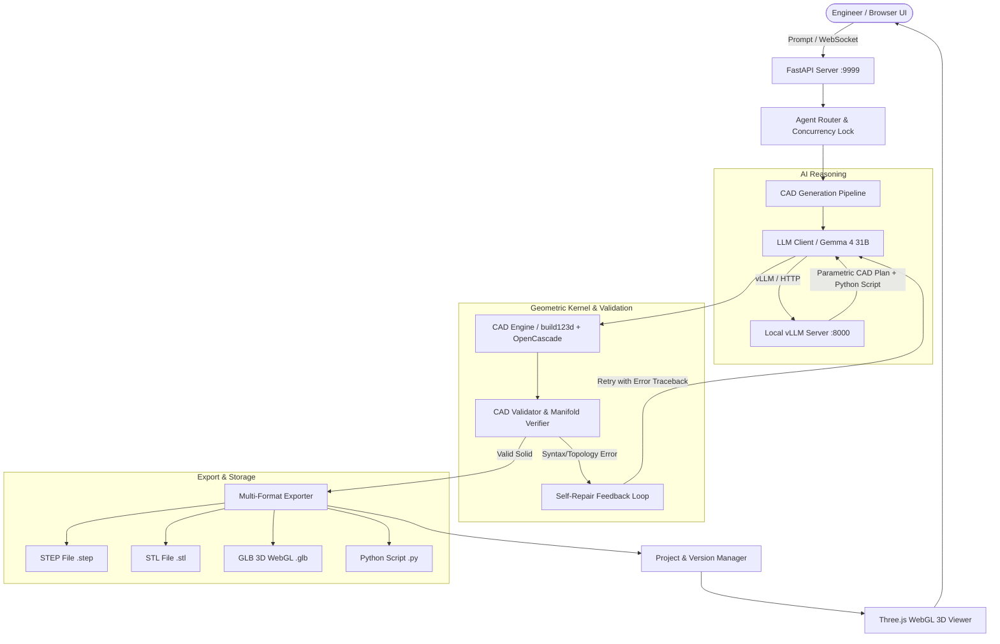

# TextToCad- 🛠️
### Next-Generation Industrial AI Text-to-CAD Engineering Workbench

[](https://www.python.org/downloads/)
[](https://fastapi.tiangolo.com)
[](https://github.com/gumyr/build123d)
[](LICENSE)

**TextToCad-** is an enterprise-grade, browser-based **Text-to-CAD Engineering Workbench** designed for industrial automation and mechanical engineers. It translates natural language mechanical descriptions into precise, watertight, ISO-standard **3D Boundary Representation (B-Rep)** CAD solids using local Large Language Models (Gemma via vLLM) and the **OpenCascade (OCCT)** geometric kernel.

---

## 🌟 Key Features

* **Natural Language to 3D Solid Geometry**: Converts complex conversational design requirements into parametric, topological 3D models.
* **OpenCascade B-Rep Engine**: Uses `build123d` and OpenCascade 7.9 to produce genuine manifold solids (not fragile polygon meshes).
* **Multi-Format Export**: Automatically generates and serves:
  * **STEP (`.step`, `.stp`)**: ISO 10303 standard format for CAD software (Autodesk Inventor, Fusion 360, SolidWorks, FreeCAD, Siemens NX).
  * **STL (`.stl`)**: Tessellated geometry for 3D printing and rapid prototyping.
  * **GLB / glTF (`.glb`)**: Optimized binary 3D assets for instant in-browser WebGL rendering.
  * **Python Script (`.py`)**: Reproducible, editable `build123d` parametric scripts.
* **Interactive 3D WebGL Viewer**: Real-time 3D inspection in the browser with orbit controls, wireframe modes, section views, and bounding box metrics.
* **Project & Version History Management**: Track iterations, rollback to previous versions, compare topologies, and branch designs.
* **Iterative Self-Healing Loop**: Automatic error feedback loop that captures OpenCascade exceptions and LLM syntax mistakes, iteratively repairing scripts until solid manifold criteria are met.
* **WebSocket Live Progress Streaming**: Real-time status broadcasting across pipeline stages (Planning ➔ Generating ➔ Building ➔ Validating ➔ Exporting).
* **Workstation & Agent Routing**: Safe orchestration architecture preventing unauthorized local license collisions on connected engineering workstations.

---

## 🏗️ Architecture & Pipeline Flow



---

## 📋 System Requirements & Prerequisites

* **Operating System**: macOS (Apple Silicon / Intel), Linux (Ubuntu 22.04/24.04 recommended), or Windows 10/11 with WSL2.
* **Python**: Python 3.10, 3.11, or 3.12.
* **C++ & Graphics Libraries**:
  * **macOS**: `brew install libomp freetype` (if needed)
  * **Ubuntu/Debian**: `sudo apt-get install -y libgl1-mesa-glx libglib2.0-0 libgomp1`
* **LLM Backend**:
  * Compatible with any OpenAI-compatible endpoint (vLLM, Ollama, LocalAI, or cloud APIs).
  * *Default config*: vLLM running `google/gemma-4-31B-it` or similar local model.
  * *Note*: If the LLM endpoint is unreachable, the system includes a **built-in deterministic parametric fallback synthesizer**.

---

## 🚀 Quickstart & Local Setup

### 1. Clone the Repository
```bash
git clone https://github.com/dkoustubh/TextToCad-.git
cd TextToCad-
```

### 2. Create and Activate a Virtual Environment
```bash
# Using python3.11 or python3
python3 -m venv .venv

# Activate on macOS/Linux:
source .venv/bin/activate

# Activate on Windows (cmd/powershell):
# .venv\Scripts\activate
```

### 3. Install Dependencies
```bash
pip install --upgrade pip
pip install -r requirements.txt
```

### 4. Configure Environment Variables
Copy the `.env.example` file to `.env` and adjust configuration parameters for your network:

```bash
cp .env.example .env
```

Key environment variables:
| Variable | Default Value | Description |
| :--- | :--- | :--- |
| `HOST` | `0.0.0.0` | Server bind IP address |
| `PORT` | `9999` | Server HTTP/WebSocket port |
| `VLLM_API_BASE` | `http://192.168.11.86:8000/v1` | vLLM / Ollama OpenAI-compatible base URL |
| `VLLM_MODEL` | `google/gemma-4-31B-it` | Model name identifier in inference server |
| `DATABASE_URL` | `postgresql+asyncpg://...` | Optional PostgreSQL database URL |
| `REDIS_URL` | `redis://...` | Optional Redis URL for pub/sub |
| `DEFAULT_WORKSTATION_IP` | `192.168.11.150` | Default engineering workstation address |
| `DEFAULT_USER_NAME` | `Koustubh Deodhar` | Default engineer identity |

### 5. Launch the Server
```bash
uvicorn app.api:app --host 0.0.0.0 --port 9999 --reload
```

Open your browser and navigate to:
```
http://localhost:9999
```

---

## 🧪 Running Automated Tests

Run the comprehensive pytest suite covering solid manifold generation, OpenCascade exports, API routing, and pipeline self-repair:

```bash
pytest
```

---

## 🚢 Production Deployment Guide

### Option 1: Systemd Service (Linux Server)

1. Create a service file at `/etc/systemd/system/text-to-cad.service`:

```ini
[Unit]
Description=Text-to-CAD Engineering Workbench
After=network.target

[Service]
Type=simple
User=ubuntu
WorkingDirectory=/opt/TextToCad-
Environment="PATH=/opt/TextToCad-/.venv/bin"
ExecStart=/opt/TextToCad-/.venv/bin/uvicorn app.api:app --host 0.0.0.0 --port 9999 --workers 4
Restart=always
RestartSec=5

[Install]
WantedBy=multi-user.target
```

2. Enable and start the service:
```bash
sudo systemctl daemon-reload
sudo systemctl enable text-to-cad
sudo systemctl start text-to-cad
sudo systemctl status text-to-cad
```

---

### Option 2: Docker Containerization

1. Create a `Dockerfile`:
```dockerfile
FROM python:3.11-slim

# Install system OpenCascade & OpenGL dependencies
RUN apt-get update && apt-get install -y --no-install-recommends \
    build-essential \
    libgl1-mesa-glx \
    libglib2.0-0 \
    libgomp1 \
    curl \
    && rm -rf /var/lib/apt/lists/*

WORKDIR /app

COPY requirements.txt .
RUN pip install --no-cache-dir -r requirements.txt

COPY . .

EXPOSE 9999

CMD ["uvicorn", "app.api:app", "--host", "0.0.0.0", "--port", "9999"]
```

2. Build and run the container:
```bash
docker build -t text-to-cad:latest .
docker run -d -p 9999:9999 --env-file .env --name text-to-cad-app text-to-cad:latest
```

---

### Option 3: Nginx Reverse Proxy & HTTPS

```nginx
server {
    listen 80;
    server_name cad.yourdomain.com;

    location / {
        proxy_pass http://127.0.0.1:9999;
        proxy_http_version 1.1;
        proxy_set_header Upgrade $http_upgrade;
        proxy_set_header Connection "upgrade";
        proxy_set_header Host $host;
        proxy_set_header X-Real-IP $remote_addr;
        proxy_set_header X-Forwarded-For $proxy_add_x_forwarded_for;
        proxy_set_header X-Forwarded-Proto $scheme;
        proxy_read_timeout 86400s;
        proxy_send_timeout 86400s;
    }
}
```

---

## 📡 API Reference

### Health & Status
* `GET /health`: Basic health check, engine version, and model endpoint.
* `GET /api/status`: System telemetry (LLM status, OpenCascade status, connected agents).

### Projects & Versions
* `GET /api/projects`: List all design projects.
* `POST /api/projects`: Create a new project workspace.
* `GET /api/projects/{project_id}`: Retrieve project details and version history tree.
* `POST /api/projects/{project_id}/versions`: Generate a new CAD version using natural language prompt.
* `POST /api/projects/{project_id}/versions/{version_label}/restore`: Roll back / restore a specific version.
* `DELETE /api/projects/{project_id}/versions/{version_label}`: Delete a version.
* `GET /api/projects/{project_id}/versions/{version_label}/files/{file_name}`: Download STEP, STL, GLB, or Python script for a version.

### Real-Time WebSocket
* `WS /ws/{session_id}`: Bi-directional WebSocket stream for live pipeline execution stages, build telemetry, and notifications.

---

## 📁 Repository Structure

```
TextToCad-/
├── app/
│   ├── __init__.py
│   ├── api.py               # FastAPI application, routes, and WebSocket endpoints
│   ├── config.py            # Pydantic Settings & environment loader
│   ├── schemas.py           # Pydantic data schemas (ChatRequest, CADPlan, VersionInfo)
│   ├── pipeline.py          # End-to-end orchestration & self-healing pipeline
│   ├── cad_engine.py        # build123d & OpenCascade solid generator & exporter
│   ├── cad_validator.py     # B-Rep manifold, volume, and bounding box validation
│   ├── llm_client.py        # vLLM/Gemma inference client and prompt templates
│   ├── project_manager.py   # Multi-project versioning & metadata storage
│   ├── agent_router.py      # Multi-workstation routing & concurrency locking
│   └── static/              # Web UI static assets
│       ├── index.html       # Workbench single-page application
│       ├── style.css        # Modern industrial UI styling
│       └── app.js           # Three.js 3D viewport, WebSocket client, & UI logic
├── tests/
│   ├── test_api.py          # FastAPI endpoint test suite
│   ├── test_cad_solid.py    # OpenCascade B-Rep solid creation tests
│   └── test_pipeline.py     # Pipeline execution and fallback tests
├── skills/                  # Domain knowledge prompt injection files
│   ├── core-engineering.md
│   └── inventor/
│       └── part-design.md
├── exports/                 # Generated CAD model exports (.step, .stl, .glb, .py)
├── .env.example             # Environment configuration template
├── .gitignore               # Git ignore rules for CAD files, caches, and venv
├── pytest.ini               # Pytest configuration
├── requirements.txt         # Production and development dependencies
└── README.md                # Project documentation
```

---

## 👤 Contributor

* **dkoustubh** ([@dkoustubh](https://github.com/dkoustubh)) — Lead Architect & Developer

---

## 📄 License

This project is licensed under the [MIT License](LICENSE).
